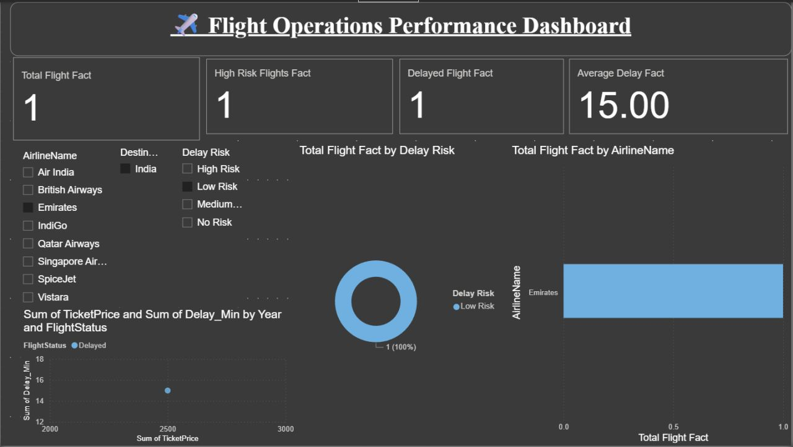

# ✈️ Flight Operations Performance Dashboard — Power BI

An interactive Power BI dashboard designed to monitor and analyse flight operations across 8 major airlines. The dashboard provides visibility into flight delays, risk classifications, airline performance, and ticket pricing trends — built on a star schema data model.

---

## 📸 Dashboard Preview



---

## 📊 Key Metrics (KPI Cards)

| Metric | Description |
|---|---|
| **Total Flight Fact** | Total number of flights tracked |
| **High Risk Flights Fact** | Count of flights classified as high risk |
| **Delayed Flight Fact** | Total number of delayed flights |
| **Average Delay Fact** | Average delay duration in minutes |

---

## 📈 Visuals Included

| Visual | Description |
|---|---|
| **Donut Chart** | Total flights distribution by Delay Risk category |
| **Bar Chart** | Total flights breakdown by Airline Name |
| **Scatter Plot** | Ticket Price vs Delay Minutes by Year & Flight Status |
| **KPI Cards** | At-a-glance summary metrics |

---

## 🔍 Filters & Slicers

- **Airline Name** — Air India, British Airways, Emirates, IndiGo, Qatar Airways, Singapore Airlines, SpiceJet, Vistara
- **Destination** — Filter by destination country/city
- **Delay Risk** — High Risk / Medium Risk / Low Risk / No Risk

---

## 🗃️ Data Model — Star Schema

```
DimAirline                 FactFlights              DimRoute
──────────────             ───────────              ──────────────
AirlineID (PK) ◄──── AirlineID (FK)          RouteID (FK) ────► RouteID (PK)
AirlineName               FlightID (PK)              Origin
AirlineType               RouteID (FK)               OriginCountry
                          DateID (FK)                Destination
DimDate                   FlightStatus               DestinationCountry
──────────────            Delay_Min
DateID (PK) ◄──── DateID (FK)           DelayRisk
Date                      FlightDuration_Min
Day                       TicketPrice
Month                     Delayed Flight Fact
Quarter                   High Risk Flights Fact
Year                      Average Delay Fact
```

---

## 📁 Files in This Repository

| File | Description |
|---|---|
| `Flight_Operations_Dashboard.pbit` | Power BI template file |
| `FactFlights (1).csv` | Fact table — 1,000 flight transaction records |
| `DimAirline (1).csv` | Dimension table — 8 airline carriers |
| `DimRoute (1).csv` | Dimension table — 12 origin-destination routes |
| `DimDate (1).csv` | Dimension table — 730 days (2022–2023) |
| `README.md` | Project documentation |

---

## 🛠️ Tools & Features Used

- **Power BI Desktop** — Dashboard design & data modelling
- **DAX** — Calculated measures for KPI cards and risk classification
- **Power Query** — Data transformation and cleaning
- **Star Schema** — DimAirline, DimDate, DimRoute + FactFlights
- **Slicers** — Interactive filtering by airline, destination, and risk
- **Donut Chart, Bar Chart, Scatter Plot** — Visual storytelling

---

## 💡 Key Insights the Dashboard Answers

- Which airlines have the highest rate of delayed flights?
- What is the correlation between ticket price and delay duration?
- Which routes carry the most high-risk flights?
- How does flight performance vary across years and quarters?

---

## 🚀 How to Run

1. Download and install **[Power BI Desktop](https://powerbi.microsoft.com/desktop/)** (free)
2. Clone or download this repository
3. Open `Flight_Operations_Dashboard.pbit` in Power BI Desktop
4. When prompted, point the data source to the CSV files in this repo
5. Interact with slicers to filter by airline, destination, or delay risk

---

## 👩‍💻 Author

**Sanjana Dandu** — Data Analyst | Mumbai, India

[](https://www.linkedin.com/in/sanjana-dandu)
[](https://github.com/SANJUDANDU)
